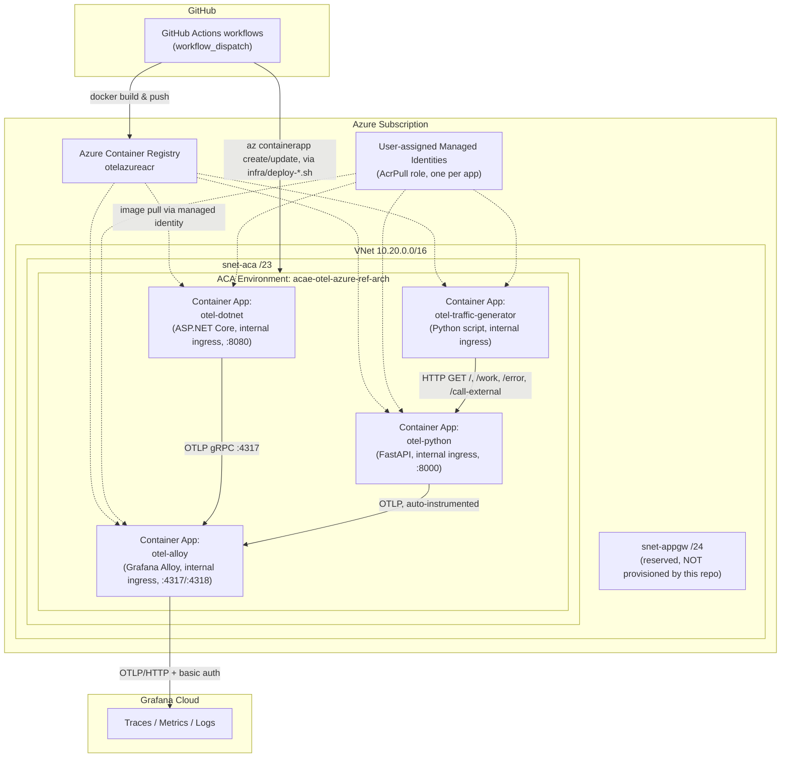
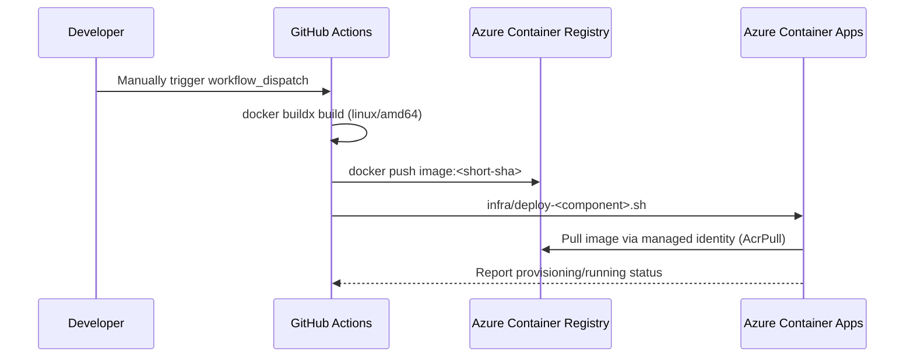
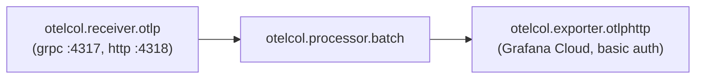

# otel-azure-ref-arch

A hands-on reference architecture demonstrating **zero-code OpenTelemetry instrumentation** for polyglot workloads (.NET and Python), collected through **Grafana Alloy** and shipped to **Grafana Cloud**, running on **Azure Container Apps (ACA)** inside a private VNet.

> **Maintainer note:** This repository is a *working reference implementation*, not a packaged product or reusable Terraform/Bicep module. A large portion of the documentation and validation tooling is scaffolded (empty placeholder files) but not yet written — see [Limitations](#limitations) and [Information Required](#information-required) before you assume something is implemented just because a file exists for it.

---

## Project Overview

### What the project does
It stands up a small, realistic distributed system on Azure and demonstrates how to get traces, metrics, and logs out of application code **without modifying the application's source for instrumentation** ("zero-code" / auto-instrumentation):

- A **.NET (ASP.NET Core minimal API)** demo service, auto-instrumented via the [OpenTelemetry .NET Automatic Instrumentation](https://github.com/open-telemetry/opentelemetry-dotnet-instrumentation) agent injected at container build time.
- A **Python (FastAPI)** demo service, auto-instrumented via `opentelemetry-distro` + `opentelemetry-bootstrap` + `opentelemetry-instrument` (the Python equivalent of zero-code instrumentation).
- A **traffic generator** that continuously calls both services so there is always telemetry flowing (useful for demos, dashboards, and alert testing).
- A **Grafana Alloy** container acting as an OpenTelemetry Collector: it receives OTLP from the apps over the private network and forwards it to **Grafana Cloud** (traces, metrics, logs) using OTLP/HTTP with basic auth.
- **Bash + Azure CLI scripts** (not Terraform/Bicep) that provision the underlying Azure infrastructure: a VNet, a delegated ACA subnet, an Application Gateway subnet, an ACA Environment, and the Container Apps themselves.
- **GitHub Actions workflows** that build container images, push them to Azure Container Registry (ACR), and invoke the same deployment scripts used locally.

### Why it exists
Instrumenting applications for observability is often seen as expensive (requires code changes, SDK wiring, maintenance). This repo exists to prove out and document a pattern where:
1. Application code stays untouched (zero-code instrumentation agents do the SDK wiring).
2. A single "sidecar-like" collector (Alloy) is the only place that knows about the observability backend (Grafana Cloud), so app containers never hold Grafana Cloud credentials.
3. Everything runs on Azure Container Apps behind a private VNet, which is a common enterprise requirement (no public ingress by default).

### Problems it solves
- **"How do I get traces/metrics/logs out of an app without engineering time to add SDKs?"** — zero-code instrumentation via Docker build steps.
- **"How do I avoid distributing observability backend credentials to every service?"** — centralize export credentials in one collector (Alloy), apps only talk OTLP to Alloy over the internal network.
- **"How do I deploy container-based services into a private network on Azure without a full IaC framework?"** — imperative, idempotent (`show` before `create`) Azure CLI scripts as a lighter-weight alternative to Bicep/Terraform.
- **"How do I generate a continuous stream of realistic telemetry for testing dashboards/alerts?"** — the traffic generator.

### Intended users
- Engineers evaluating **OpenTelemetry zero-code instrumentation** on .NET or Python.
- Engineers evaluating **Grafana Alloy as an OTel Collector** on Azure Container Apps.
- Anyone who needs a **minimal, disposable reference environment** to demo distributed tracing/metrics/logs end-to-end on Azure without adopting a full IaC/GitOps stack.

### Key capabilities
- Zero-code OpenTelemetry for ASP.NET Core (.NET 10) and FastAPI (Python 3.12+).
- Centralized telemetry export via Grafana Alloy → Grafana Cloud (OTLP/HTTP, basic auth).
- Private-network Azure Container Apps deployment (internal ingress only, ACA environment injected into a delegated VNet subnet).
- Manually-triggered, per-component CI/CD via GitHub Actions (build → push to ACR → deploy).
- Idempotent shell-script "infrastructure as code" (safe to re-run; scripts check for existing resources before creating them).

---

## Features

- **Zero-code .NET instrumentation** — the `otel-dotnet` Docker image downloads and installs the OpenTelemetry .NET Auto-Instrumentation agent (`OTEL_VERSION=1.16.0` by default) at build time and starts the app through `instrument.sh`, requiring no code-level SDK usage in [Program.cs](apps/otel-dotnet/app/Program.cs).
- **Zero-code Python instrumentation** — the `otel-python` image runs `opentelemetry-bootstrap` to auto-install instrumentation packages for the app's actual dependencies, then launches the app via `opentelemetry-instrument uvicorn ...` (see [Dockerfile](apps/otel-python/Dockerfile)).
- **Demo endpoints for common telemetry scenarios**: a fast success path (`/`), a variable-latency path (`/work`), a path that raises an unhandled exception (`/error`), and a path that makes an outbound HTTP call to `httpbin.org` (`/call-external`) to demonstrate distributed/downstream span propagation.
- **Synthetic traffic generator** — a dependency-free Python script that polls random endpoints on an interval and prints structured request logs (see [app.py](apps/traffic-generator/app.py)).
- **Centralized OTLP collection with Grafana Alloy** — a single [config.alloy](otel-alloy/config.alloy) pipeline that receives OTLP gRPC (4317) and HTTP (4318), batches it, and exports to Grafana Cloud via `otelcol.exporter.otlphttp` with basic auth sourced from environment variables.
- **Private Azure Container Apps networking** — a dedicated `/23` subnet delegated to `Microsoft.App/environments`, plus a separate `/24` subnet reserved for an Application Gateway (see [Assumptions](#assumptions-and-open-questions) — the gateway itself is not deployed by any script in this repo).
- **Managed-identity based ACR pull** — every deploy script creates/reuses a user-assigned managed identity with the `AcrPull` role instead of embedding registry credentials in the Container App.
- **Idempotent deployment scripts** — every `infra/*.sh` script checks `az ... show` before calling `az ... create`, so re-running a script is safe and won't fail on "already exists" errors.
- **Per-component GitHub Actions pipelines** — independent, manually-triggered (`workflow_dispatch`) build+deploy pipelines for the .NET app, Python app, Alloy, and the traffic generator.

---

## Architecture

### High-level architecture



### Major components and responsibilities

| Component | Location | Responsibility |
|---|---|---|
| `otel-dotnet` | [apps/otel-dotnet](apps/otel-dotnet) | ASP.NET Core minimal API demo service. Zero-code instrumented via the OpenTelemetry .NET Auto-Instrumentation agent baked into the Docker image. |
| `otel-python` | [apps/otel-python](apps/otel-python) | FastAPI demo service. Zero-code instrumented via `opentelemetry-instrument` at container start. |
| `traffic-generator` | [apps/traffic-generator](apps/traffic-generator) | Continuously polls the Python app's endpoints to keep telemetry flowing; not itself instrumented with OpenTelemetry. |
| `otel-alloy` | [otel-alloy](otel-alloy) | Grafana Alloy — receives OTLP from the two demo apps, batches it, and forwards to Grafana Cloud. The only component holding Grafana Cloud credentials. |
| `infra/*.sh` | [infra](infra) | Azure CLI scripts for provisioning the VNet/subnets/ACA environment (`deploy.sh`) and for building/deploying each app image (`build-*.sh` / `deploy-*.sh`). |
| GitHub Actions workflows | [.github/workflows](.github/workflows) | CI/CD: build each component's Docker image, push to ACR, then call the matching `infra/deploy-*.sh` script. |
| `docs/` | [docs](docs) | Documentation scaffold (architecture, deployment, networking, security, telemetry, troubleshooting, ADRs). **Currently all empty placeholders** — see [Limitations](#limitations). |
| `scripts/` | [scripts](scripts) | Scaffold for validation/traffic helper scripts (`validate-infra.sh`, `validate-alloy.sh`, `validate-telemetry.sh`, `generate-traffic.sh`). **Currently all empty placeholders.** |

### External dependencies

| Dependency | Purpose | Where it's used |
|---|---|---|
| Azure Container Apps (ACA) | Hosting runtime for all four containers | `infra/deploy.sh`, `infra/deploy-*.sh` |
| Azure Container Registry (ACR) | Private image registry | all `infra/build-*.sh` / `infra/deploy-*.sh`, all GitHub workflows |
| Azure Virtual Network | Private networking + subnet delegation for ACA | `infra/deploy.sh` |
| Azure Managed Identity + RBAC (`AcrPull`) | Registry auth for Container Apps, avoids embedding credentials | `infra/deploy-*.sh` |
| Grafana Cloud | Telemetry backend (traces, metrics, logs) | `otel-alloy/config.alloy`, `deploy-alloy.yml` |
| GitHub Actions + `azure/login` | CI/CD execution and Azure authentication | `.github/workflows/*.yml` |
| OpenTelemetry .NET Auto-Instrumentation (GitHub release asset) | Zero-code instrumentation for the .NET app | `apps/otel-dotnet/Dockerfile` |
| `opentelemetry-distro` / `opentelemetry-bootstrap` (PyPI) | Zero-code instrumentation for the Python app | `apps/otel-python/pyproject.toml`, `Dockerfile` |
| `uv` (Astral) | Python dependency management/build tool inside the container | `apps/otel-python/Dockerfile` |
| `httpbin.org` (public internet) | External call target for the `/call-external` demo endpoint | `Program.cs`, `main.py` |
| Podman | Container build/push tool used by local developer scripts | `infra/build-*.sh` |
| Docker Buildx | Container build/push tool used in CI | `.github/workflows/*.yml` |

> **Surprising for new maintainers:** local build scripts (`infra/build-*.sh`) use **Podman**, while CI (`.github/workflows/*.yml`) uses **Docker Buildx**. Both must be able to build `linux/amd64` images (some developer machines are ARM, e.g. Apple Silicon), and the Alloy build script explicitly fails if the built image isn't `linux/amd64`.

### Data flow

1. Traffic generator issues an HTTP request to a random endpoint on `otel-python` (or `otel-dotnet`, if configured as the target).
2. The app's zero-code OpenTelemetry agent captures the request as a trace span, plus metrics and structured logs.
3. The app exports OTLP data to `otel-alloy` over the ACA environment's internal DNS (`http://otel-alloy:4317`), because both are in the same ACA Environment and Alloy has `internal` ingress.
4. Alloy batches the received traces/metrics/logs (`otelcol.processor.batch`) and forwards them to Grafana Cloud over OTLP/HTTP with basic auth (`otelcol.exporter.otlphttp` + `otelcol.auth.basic`).
5. Engineers view the data in Grafana Cloud (dashboards/Explore) — Grafana Cloud itself is out of scope for this repo (bring your own account/stack).

---

## Repository Structure

```
otel-azure-ref-arch/
├── apps/
│   ├── otel-dotnet/          # ASP.NET Core demo service (zero-code instrumented)
│   │   ├── app/              # Program.cs, app.csproj (source)
│   │   └── Dockerfile        # Installs OTel .NET auto-instrumentation agent
│   ├── otel-python/          # FastAPI demo service (zero-code instrumented)
│   │   ├── app/main.py       # Source
│   │   ├── pyproject.toml    # Python deps (fastapi, uvicorn, httpx, otel-distro)
│   │   └── Dockerfile        # Uses `uv`, opentelemetry-bootstrap, opentelemetry-instrument
│   └── traffic-generator/    # Minimal stdlib-only Python polling script
│       ├── app.py
│       └── Dockerfile
├── otel-alloy/
│   ├── config.alloy          # Grafana Alloy pipeline (OTLP in → Grafana Cloud out)
│   ├── Dockerfile            # Alloy container image
│   ├── .env.example          # Placeholder — currently empty (see Limitations)
│   └── .gitignore
├── infra/                    # Azure CLI ("infra-as-bash") scripts
│   ├── deploy.sh              # Provisions VNet, subnets, ACA Environment
│   ├── build-alloy.sh         # podman build + push Alloy image to ACR
│   ├── build-dotnet.sh        # podman build + push .NET image to ACR
│   ├── build-python.sh        # podman build + push Python image to ACR
│   ├── build-traffic-generator.sh
│   ├── deploy-alloy.sh        # Creates/updates the Alloy Container App
│   ├── deploy-dotnet.sh       # Creates/updates the .NET Container App
│   ├── deploy-python.sh       # Creates/updates the Python Container App
│   ├── deploy-traffic-generator.sh
│   └── destroy.sh             # Placeholder — currently empty (no teardown automation exists)
├── scripts/                   # Placeholder validation/helper scripts — all currently empty
│   ├── generate-traffic.sh
│   ├── validate-alloy.sh
│   ├── validate-infra.sh
│   └── validate-telemetry.sh
├── docs/                       # Documentation scaffold — all files currently empty
│   ├── architecture.md, deployment.md, networking.md,
│   │   prerequisites.md, security.md, telemetry.md, troubleshooting.md
│   └── adr/                    # Architecture Decision Records — titles exist, bodies are empty
│       ├── 001-why-alloy.md
│       ├── 002-otlp-contract.md
│       ├── 003-private-aca.md
│       └── 004-centralized-telemetry.md
├── .github/workflows/           # GitHub Actions CI/CD (manual trigger only)
│   ├── buildAndDeployDotnet.yml
│   ├── deploy-alloy.yml
│   ├── deploy-python.yml
│   └── deploy-traffic-generator.yml
└── .gitignore
```

### Configuration locations
- Alloy's runtime config: [otel-alloy/config.alloy](otel-alloy/config.alloy) (compiled into the image; not a runtime-mounted config).
- Per-app environment variables: set at deploy time by the `infra/deploy-*.sh` scripts (`--env-vars` / `--set-env-vars` flags), not stored in a checked-in `.env` file for deployed environments.
- Local secret template: [otel-alloy/.env.example](otel-alloy/.env.example) — present but **empty**; you must populate it yourself (see [Configuration](#configuration)).
- CI/CD configuration: GitHub Actions **repository/environment variables** (`vars.*`) and **secrets** (`secrets.*`) referenced throughout [.github/workflows](.github/workflows) — these are configured in the GitHub repository settings, not in this codebase.

### Generated artifacts / build outputs
- `apps/otel-dotnet/app/bin/`, `apps/otel-dotnet/app/obj/` — .NET build output (git-ignored).
- Container images — built and pushed to Azure Container Registry; not stored in the repo.
- No local build produces artifacts outside the Docker images; there is no root-level build system (no `Makefile`, no root `package.json`/`npm` scripts).

---

## Getting Started

### Prerequisites

| Requirement | Why it's needed | Notes |
|---|---|---|
| Azure subscription with Owner/Contributor + User Access Administrator (or equivalent) | Deploy VNet, ACA, ACR, managed identities, role assignments | Role assignment (`AcrPull`) requires RBAC write permission |
| [Azure CLI (`az`)](https://learn.microsoft.com/cli/azure/) with the `containerapp` extension | All `infra/*.sh` scripts call `az` directly | Scripts auto-install/update the `containerapp` extension if missing |
| Podman (local builds) | `infra/build-*.sh` scripts use `podman build`/`podman push` | Must support building `linux/amd64` images even on ARM hosts |
| Docker + Buildx (CI only, or if you prefer Docker locally) | CI workflows use `docker/build-push-action` | Not required locally unless you replace Podman with Docker |
| .NET SDK 10.0 | Building/running `otel-dotnet` outside a container | Matches `TargetFramework` in [app.csproj](apps/otel-dotnet/app/app.csproj) |
| Python 3.12+ and [`uv`](https://docs.astral.sh/uv/) | Building/running `otel-python` outside a container | Dockerfile uses `uv sync`; `pyproject.toml` requires Python `>=3.11` |
| Python 3.x (any recent) | Running `traffic-generator` locally | Uses only the standard library |
| Git | Image tagging uses `git rev-parse --short HEAD`; scripts require `git` on `PATH` | Build/deploy will fail outside a git checkout |
| Grafana Cloud account (or compatible OTLP endpoint) | Alloy exports telemetry there | You need an Instance ID, API key, and OTLP endpoint URL |
| GitHub repository secrets/vars (for CI) | Azure login + app configuration in workflows | See [Configuration](#configuration) |

### Installation

1. **Clone the repository.**
   ```bash
   git clone https://github.com/dpdeepankar/otel-azure-ref-arch.git
   cd otel-azure-ref-arch
   ```
2. **Authenticate to Azure.**
   ```bash
   az login
   az extension add --name containerapp --upgrade
   ```
3. **Create an Azure Container Registry** (not automated by any script in this repo — see [Information Required](#information-required)):
   ```bash
   az acr create --resource-group rg-otel-azure-ref-arch --name otelazureacr --sku Basic --location centralindia
   ```
4. **Set the required environment variables** for the foundation deploy:
   ```bash
   export AZURE_SUBSCRIPTION_ID="<your-subscription-id>"
   export AZURE_RESOURCE_GROUP="rg-otel-azure-ref-arch"        # optional, this is the default
   export AZURE_LOCATION="centralindia"                          # optional, this is the default
   ```
5. **Provision the network + ACA environment.**
   ```bash
   chmod +x infra/*.sh
   ./infra/deploy.sh
   ```
6. **Obtain Grafana Cloud credentials** (Instance ID, API key, OTLP endpoint) from your Grafana Cloud account and export them:
   ```bash
   export GRAFANA_CLOUD_INSTANCE_ID="<instance-id>"
   export GRAFANA_CLOUD_API_KEY="<api-key>"
   export GRAFANA_CLOUD_OTLP_ENDPOINT="<otlp-endpoint-url>"
   export AZURE_ACR_NAME="otelazureacr"
   ```
7. **Build and deploy Alloy first** (apps depend on it being reachable by name):
   ```bash
   ./infra/build-alloy.sh
   ./infra/deploy-alloy.sh
   ```
8. **Build and deploy the demo apps.**
   ```bash
   ./infra/build-dotnet.sh
   ./infra/deploy-dotnet.sh

   ./infra/build-python.sh
   ./infra/deploy-python.sh
   ```
9. **(Optional) Build and deploy the traffic generator** to keep telemetry flowing continuously:
   ```bash
   ./infra/build-traffic-generator.sh
   ./infra/deploy-traffic-generator.sh
   ```

### Running the Project

**Locally, without Azure (fastest inner loop):**
```bash
# .NET app
cd apps/otel-dotnet/app
dotnet run
# → listens on http://localhost:5000 (or as configured); no OTel exporter is wired unless you set
#   OTEL_* env vars — the container image is what actually installs the auto-instrumentation agent.

# Python app
cd apps/otel-python
uv sync
uv run uvicorn app.main:app --reload
# → listens on http://localhost:8000
```

**Locally, via containers (closest to production behavior):**
```bash
cd apps/otel-python
podman build -t otel-python:local .
podman run -p 8000:8000 otel-python:local
```
> Zero-code instrumentation only takes effect through the Docker image's `ENTRYPOINT`/`CMD` (`instrument.sh` for .NET, `opentelemetry-instrument` for Python). Running `dotnet run` / `uvicorn` directly on your host bypasses instrumentation entirely — this is a common point of confusion for new contributors.

**On Azure (after deployment):** Container Apps in this repo use `--ingress internal`, meaning **there is no public URL**. To reach a deployed app you must either:
- Exec into another Container App in the same environment and curl the internal DNS name (e.g. `http://otel-python`), or
- Temporarily switch ingress to `external` (`az containerapp ingress enable --type external ...`) for debugging, or
- Deploy something on the reserved Application Gateway subnet (not automated here — see [Information Required](#information-required)).

### Building

| Component | Local build command | CI build |
|---|---|---|
| .NET app | `./infra/build-dotnet.sh` (podman) | `buildAndDeployDotnet.yml` (docker buildx) |
| Python app | `./infra/build-python.sh` (podman) | `deploy-python.yml` (docker buildx) |
| Alloy | `./infra/build-alloy.sh` (podman) | `deploy-alloy.yml` (docker buildx) |
| Traffic generator | `./infra/build-traffic-generator.sh` (podman) | `deploy-traffic-generator.yml` (docker buildx) |

All build scripts tag images as `<image-name>:<git-short-sha>` by default and push directly to ACR — there is no local-only build target that skips the registry push.

### Testing

**Information Required** — no test projects, test frameworks, or test configuration were found in this repository:
- No unit test project for the .NET app (no `*.Tests.csproj`).
- No `pytest`/`tests/` directory for the Python app or traffic generator.
- No end-to-end or integration test suite.
- No coverage tooling or coverage reporting configuration.
- The `scripts/validate-*.sh` files appear intended to serve as smoke/validation tests but are currently **empty placeholders** with no implementation.

If you add tests, document the commands here and add a corresponding CI job — none of the current GitHub Actions workflows run tests before deploying.

---

## Configuration

### Environment variables — application runtime (set by deploy scripts on the Container App)

| Variable | Applies to | Default | Purpose |
|---|---|---|---|
| `OTEL_SERVICE_NAME` | .NET, Python | `zero-code-dotnet-demo` / `zero-code-python-demo` | Service name attached to all telemetry |
| `OTEL_TRACES_EXPORTER` / `OTEL_METRICS_EXPORTER` / `OTEL_LOGS_EXPORTER` | .NET, Python | `otlp` (Azure) / `console` (Dockerfile default) | Where telemetry is sent |
| `OTEL_EXPORTER_OTLP_ENDPOINT` | .NET, Python | `http://otel-alloy:4317` | Points apps at the Alloy Container App over internal DNS |
| `OTEL_EXPORTER_OTLP_PROTOCOL` | .NET, Python | `grpc` | Must match Alloy's `otelcol.receiver.otlp` `grpc` block |
| `OTEL_METRIC_EXPORT_INTERVAL` | .NET, Python | `5000` (ms) | How often metrics are flushed |
| `OTEL_RESOURCE_ATTRIBUTES` | .NET, Python | `deployment.environment=azure` | Resource-level tagging |
| `TARGET_URL` | traffic-generator | `http://otel-python` | Which service to poll |
| `REQUEST_INTERVAL` | traffic-generator | `5` (seconds) | Delay between requests |
| `REQUEST_TIMEOUT` | traffic-generator | `10` (seconds) | Per-request timeout |

### Environment variables — Alloy (secrets, read from container env at runtime)

| Variable | Required | Purpose |
|---|---|---|
| `GRAFANA_CLOUD_INSTANCE_ID` | Yes | Basic auth username for the Grafana Cloud OTLP endpoint |
| `GRAFANA_CLOUD_API_KEY` | Yes | Basic auth password (**secret** — never commit) |
| `GRAFANA_CLOUD_OTLP_ENDPOINT` | Yes | Grafana Cloud's OTLP/HTTP ingestion URL |

### Environment variables — deployment scripts (`infra/*.sh`)

| Variable | Default | Purpose |
|---|---|---|
| `AZURE_SUBSCRIPTION_ID` | *(required, no default)* | Target subscription |
| `AZURE_RESOURCE_GROUP` | `rg-otel-azure-ref-arch` | Resource group for all resources |
| `AZURE_LOCATION` | `centralindia` | Azure region |
| `AZURE_VNET_NAME` | `vnet-otel-azure-ref-arch` | VNet name |
| `VNET_CIDR` | `10.20.0.0/16` | VNet address space |
| `ACA_SUBNET_NAME` / `ACA_SUBNET_CIDR` | `snet-aca` / `10.20.0.0/23` | Delegated subnet for the ACA environment |
| `APPGW_SUBNET_NAME` / `APPGW_SUBNET_CIDR` | `snet-appgw` / `10.20.2.0/24` | Reserved subnet for a future Application Gateway |
| `AZURE_ACA_ENV_NAME` | `acae-otel-azure-ref-arch` | ACA Environment name |
| `AZURE_ACR_NAME` | `otelazureacr` | Registry name (must be globally unique — you will likely need to override this) |
| `AZURE_ALLOY_APP_NAME` | `otel-alloy` | Alloy Container App name (also used as the internal DNS name apps talk to) |
| `DOTNET_APP_NAME` / `PYTHON_APP_NAME` / `TRAFFIC_GENERATOR_APP_NAME` | `otel-dotnet` / `otel-python` / `otel-traffic-generator` | Container App names |

### Runtime settings / defaults worth knowing
- All Container Apps are created with `--ingress internal` — **no public endpoint by default**.
- Default CPU/memory: `.NET` 0.5 vCPU / 1.0Gi, `traffic-generator` 0.25 vCPU / 0.5Gi (see [infra/deploy-dotnet.sh](infra/deploy-dotnet.sh), [infra/deploy-traffic-generator.sh](infra/deploy-traffic-generator.sh)); Python app defaults are set analogously in `infra/deploy-python.sh`.
- Image tags default to the **short git SHA** of the commit being built, not `latest` (except Alloy's build script, which defaults to `latest` unless `AZURE_ALLOY_IMAGE_TAG` is set) — be deliberate about which tag you deploy.

### Secrets handling
- **Local/manual runs:** secrets (Grafana Cloud credentials, Azure subscription context) are expected to be exported as shell environment variables before running scripts. There is no secrets manager integration (Key Vault, etc.) in this repo.
- **CI:** secrets live in **GitHub Actions repository/environment secrets** (`secrets.AZURE_CLIENT_ID`, `secrets.AZURE_CLIENT_SECRET`, `secrets.AZURE_TENANT_ID`, `secrets.AZURE_SUBSCRIPTION_ID`, `secrets.GRAFANA_CLOUD_*`). Non-secret configuration lives in repository/environment **variables** (`vars.*`).
- `.gitignore` excludes `.env`, `.env.*` (except `.env.example`), `*.key`, and `*.pem` — respect this pattern if you add new secret files.
- **Caution:** [buildAndDeployDotnet.yml](.github/workflows/buildAndDeployDotnet.yml) declares `permissions: id-token: write` (suggesting OIDC federated login) **but also passes `client-secret`** to `azure/login`. This is an inconsistent auth pattern — determine whether your Azure AD App Registration is configured for OIDC (federated credentials, no secret needed) or classic client-secret auth, and align the workflow accordingly before relying on it.

---

## Usage

**Call the .NET demo endpoints (once deployed, from inside the ACA environment or via a temporary external ingress):**
```bash
curl http://otel-dotnet/            # {"message":"hello from zero-code otel demo"}
curl http://otel-dotnet/work        # simulated variable-latency work
curl http://otel-dotnet/error       # intentionally throws, producing an error span
curl http://otel-dotnet/call-external  # outbound call to httpbin.org, demonstrates trace propagation
```

**Call the Python demo endpoints (same shape as .NET, for comparing instrumentation parity across languages):**
```bash
curl http://otel-python/
curl http://otel-python/work
curl http://otel-python/error
curl http://otel-python/call-external
```

**Point the traffic generator at a different target:**
```bash
export TRAFFIC_GENERATOR_TARGET_URL="http://otel-dotnet"
./infra/deploy-traffic-generator.sh
```

**Rebuild and redeploy after a code change (example: Python app):**
```bash
./infra/build-python.sh     # builds + pushes <acr>/otel-python:<git-sha>, prints export commands
# copy/export the printed AZURE_PYTHON_IMAGE / tag values, then:
./infra/deploy-python.sh
```

---

## Development Guide

### Code structure
- Each app is self-contained under `apps/<name>/` with its own `Dockerfile`; there is no shared library code between the .NET and Python apps by design (they are meant to be independently comparable implementations of the same demo API surface: `/`, `/work`, `/error`, `/call-external`).
- Deployment logic lives entirely in `infra/*.sh`, written to be idempotent (`az ... show` guarded by `|| true`/exit-code checks before `az ... create`).

### Important design patterns
- **Sidecar-less centralized collector**: Alloy is a *shared* Container App, not a per-pod sidecar — apps reach it by ACA's internal DNS (`http://otel-alloy:<port>`). This keeps Grafana Cloud credentials out of every app's environment.
- **"Show, then create" idempotency pattern**: every resource-creation step in the shell scripts first checks whether the resource exists (`az ... show ... 2>/dev/null`) and only creates if missing — a lightweight substitute for a declarative IaC tool's plan/apply model. This means you **can** re-run any script safely, but it also means the scripts are not a true source of truth for infrastructure state (drift is possible, e.g. someone hand-edits a Container App in the portal).
- **Managed-identity-only registry auth**: no admin credentials or access tokens for ACR are used; every deploy script provisions a user-assigned managed identity + `AcrPull` role assignment.

### Development workflow
1. Make a code change under `apps/<name>` or `otel-alloy`.
2. Test locally (see [Running the Project](#running-the-project)).
3. Run the matching `infra/build-*.sh` to build and push a new image tagged with your current commit's short SHA.
4. Run the matching `infra/deploy-*.sh` to update the Container App, or trigger the matching GitHub Actions workflow (`workflow_dispatch`) to do the same from CI.

### Branching strategy
**Information Required** — the repository has a single `main` branch with a linear commit history (`feat:`/`fix:` conventional-commit-style messages). No branch protection rules, PR templates, or CODEOWNERS file were found in the repository, so no enforced branching/review strategy can be documented from the code alone.

### Coding standards and conventions
- Commit messages follow a loose **Conventional Commits** style (`feat: ...`, `fix: ...`) based on git history, but this is not enforced by any linter/hook in the repo.
- Shell scripts consistently use `set -euo pipefail`, a `log()` helper for section banners, and a `fail()` helper for hard errors — follow this pattern in any new `infra/*.sh` script.
- No linter/formatter configuration (`.editorconfig`, ESLint/Prettier/`dotnet format`/`ruff`/`black` config) was found for either app — style is currently whatever the original author used.

---

## Deployment

### Deployment process
Deployment is **manual and per-component** — either by running the relevant `infra/deploy-*.sh` script locally, or by manually triggering the matching GitHub Actions workflow (all workflows use `on: workflow_dispatch` — **none run automatically on push or PR**).



### Environment differences
**Information Required** — only a single implicit environment is defined (default resource group `rg-otel-azure-ref-arch`, default region `centralindia`). There are no separate dev/staging/prod configurations, parameter files, or GitHub Actions **environments** referenced in the workflows. To run multiple environments you would need to override the `AZURE_RESOURCE_GROUP`/`AZURE_ACA_ENV_NAME`/etc. variables per invocation — this is not automated today.

### Release process
There is no version tagging, changelog, or release automation in this repository. Each deploy publishes whatever is on the current branch tip, tagged by its short git SHA. Treat every `workflow_dispatch` run as its own ad hoc release.

### Rollback process
**Information Required / manual only.** Azure Container Apps keeps prior **revisions**, so a rollback in practice means:
```bash
# List revisions and find the previous good one
az containerapp revision list --resource-group rg-otel-azure-ref-arch --name otel-python -o table

# Activate the previous revision / shift traffic back to it
az containerapp ingress traffic set \
  --resource-group rg-otel-azure-ref-arch \
  --name otel-python \
  --revision-weight <previous-revision-name>=100
```
No script in this repo automates this — it is a manual `az` operation you must perform yourself.

---

## CI/CD

| Workflow | Trigger | Builds | Pushes to | Deploys via |
|---|---|---|---|---|
| [buildAndDeployDotnet.yml](.github/workflows/buildAndDeployDotnet.yml) | `workflow_dispatch` | `apps/otel-dotnet` (linux/amd64) | ACR | `infra/deploy-dotnet.sh` |
| [deploy-alloy.yml](.github/workflows/deploy-alloy.yml) | `workflow_dispatch` | `otel-alloy` (linux/amd64) | ACR | `infra/deploy-alloy.sh` |
| [deploy-python.yml](.github/workflows/deploy-python.yml) | `workflow_dispatch` | `apps/otel-python` (linux/amd64) | ACR | `infra/deploy-python.sh` |
| [deploy-traffic-generator.yml](.github/workflows/deploy-traffic-generator.yml) | `workflow_dispatch` | `apps/traffic-generator` (linux/amd64) | ACR | `infra/deploy-traffic-generator.sh` |

**Pipeline flow (all four workflows follow the same two-job shape):**
1. **`build` job:** checkout → Azure login → resolve ACR login server → `az acr login` → compute image tag from `${GITHUB_SHA::8}` → Docker Buildx build+push → verify image landed in ACR.
2. **`deploy` job:** checkout → Azure login → run the matching `infra/deploy-*.sh` script with the built image reference passed via environment variables → verify the Container App's `provisioningState`/`runningStatus`.

**No test process exists in CI** — none of the workflows run unit, integration, or e2e tests before deploying (see [Testing](#testing)). There is also no CI job that runs on pull requests, so nothing gates a code change before it can be manually deployed.

---

## Monitoring and Observability

| Concern | How it's handled | Notes |
|---|---|---|
| Logging | App logs are captured via the auto-instrumentation agent (`OTEL_LOGS_EXPORTER`) and shipped through Alloy | Default Dockerfile exporter is `console` (useful when running the container standalone); Azure deploys override it to `otlp` |
| Metrics | Emitted every 5s by default (`OTEL_METRIC_EXPORT_INTERVAL=5000`) via OTLP | No dashboards are checked into this repo — build them in Grafana Cloud yourself |
| Tracing | Auto-instrumented spans for inbound HTTP requests and the outbound `httpbin.org` call in `/call-external`, enabling a simple 2-hop distributed trace demo | Alloy uses `otelcol.processor.batch` before export, so there is a small buffering delay |
| Health checks | **None found** — no `/health` or `/livez` endpoint is implemented in either app, and Container Apps are created without `--liveness-probe`/`--readiness-probe` flags | Information Required if you need proper ACA health probes |
| Alerting | **Not implemented in this repo** — would need to be configured directly in Grafana Cloud | Information Required |

**Alloy pipeline** ([config.alloy](otel-alloy/config.alloy)):


---

## Troubleshooting

| Symptom | Possible Cause | Resolution |
|---|---|---|
| `AZURE_SUBSCRIPTION_ID is required` when running any `infra/*.sh` script | Script uses bash's `${VAR:?msg}` required-variable syntax; env var not exported | `export AZURE_SUBSCRIPTION_ID=<id>` before running the script |
| `deploy-alloy.sh` / `deploy-dotnet.sh` fails with "ACA environment is not ready" | `infra/deploy.sh` was never run, or is still provisioning | Run `./infra/deploy.sh` first and wait for `provisioningState: Succeeded` |
| `deploy-python.sh` fails with "Alloy Container App ... was not found" | Apps depend on Alloy for OTLP export; deployment order matters | Deploy Alloy (`build-alloy.sh` + `deploy-alloy.sh`) before any app |
| `build-alloy.sh` / `build-dotnet.sh` fails with "Podman is required" | Podman not installed locally | Install Podman, or adapt the script to use `docker build`/`docker push` |
| Alloy build fails with "Alloy image must be linux/amd64" | Building on an ARM host (e.g. Apple Silicon) without cross-platform emulation configured | Ensure Podman/Docker has `linux/amd64` emulation enabled (e.g. via `qemu-user-static`) before building |
| Can't `curl` a deployed Container App from your laptop | All apps use `--ingress internal`; there is no public URL | Exec into another Container App on the same environment, or temporarily enable external ingress for debugging |
| No telemetry appears in Grafana Cloud | Alloy is missing/misconfigured `GRAFANA_CLOUD_*` env vars, or apps aren't pointed at Alloy | Verify Alloy's Container App env vars; confirm apps' `OTEL_EXPORTER_OTLP_ENDPOINT=http://otel-alloy:4317` matches the Alloy Container App's actual name |
| GitHub Actions `azure/login` step fails | Mixed OIDC/secret auth pattern in `buildAndDeployDotnet.yml` (declares `id-token: write` but also passes `client-secret`) | Decide whether you're using OIDC federated credentials or classic client-secret auth, and configure the App Registration + workflow input consistently |
| `az acr show` fails with a "not found" style error during any build/deploy script | ACR was never created, or `AZURE_ACR_NAME` doesn't match an existing registry | Create the ACR manually (`az acr create ...`) — no script in this repo provisions it |
| Running `dotnet run` or `uvicorn` locally shows no telemetry at all | Zero-code instrumentation is wired into the **Docker image's entrypoint**, not the app process itself | Run the app via its Docker image (`podman build && podman run`) to get instrumentation, or manually add the OTel SDK for local dev |
| `infra/destroy.sh` does nothing | The file exists but is currently an **empty placeholder** | Tear down resources manually with `az group delete --name rg-otel-azure-ref-arch --yes --no-wait` (irreversible — confirm the resource group only contains this project's resources) |

---

## Security

### Authentication
- **Azure resource access (scripts/CI):** `az login` locally, or `azure/login` GitHub Action in CI using a Service Principal (client ID/secret/tenant) — see the [Secrets handling](#secrets-handling) note about the mixed OIDC/secret pattern in `buildAndDeployDotnet.yml`.
- **Container image registry auth:** user-assigned managed identities with the `AcrPull` RBAC role — no admin username/password or static tokens are used for ACR access from Container Apps.
- **Grafana Cloud auth:** HTTP Basic Auth (`GRAFANA_CLOUD_INSTANCE_ID` as username, `GRAFANA_CLOUD_API_KEY` as password) configured only inside Alloy.
- **Application-level auth:** **none.** The demo apps expose unauthenticated endpoints; this is acceptable only because they are never given public ingress by default.

### Authorization
- Azure RBAC role assignments are scoped narrowly: each managed identity is granted `AcrPull` (role ID `7f951dda-4ed3-4680-a7ca-43fe172d538d`) **only on the ACR resource**, not subscription- or resource-group-wide.
- No application-level authorization (no auth middleware, no API keys) exists in either demo app — do not use these apps as templates for anything that will be internet-facing.

### Secrets management
- No secret store (Key Vault, etc.) integration exists. Secrets are passed as plain environment variables at deploy time (`--env-vars` on `az containerapp create/update`), which means they are visible via `az containerapp show` to anyone with read access to the Container App.
- `.gitignore` excludes `.env*` (except `.env.example`), `*.key`, `*.pem` — a reasonable baseline, but there's no secret-scanning CI job configured in this repo to enforce it.

### Security considerations / surprises for new maintainers
- **No public ingress by default** is a deliberate security posture (private-by-default), but it means the "getting started" experience requires extra steps (internal DNS calls, or manually flipping ingress) that are easy to forget.
- **The Application Gateway subnet is reserved but nothing deploys an Application Gateway or WAF** — if you intend to expose these apps publicly, you must add that yourself; don't assume a WAF is protecting anything.
- **No health probes** means Azure Container Apps has no way to automatically detect and restart an unhealthy replica beyond basic process liveness.
- The `/call-external` endpoints make **outbound calls to a public third-party domain (`httpbin.org`)** from inside your VNet — confirm your organization's egress/firewall policy permits this before relying on it, or point it at an internal test target instead.

### Dependencies and supply chain controls
- The .NET Dockerfile downloads the OpenTelemetry auto-instrumentation installer via `ADD https://github.com/.../otel-dotnet-auto-install.sh` at a **pinned version** (`OTEL_VERSION=1.16.0` default) — pinned, but not checksum-verified in the Dockerfile.
- The Python Dockerfile pulls `uv` from `ghcr.io/astral-sh/uv:latest` — **not pinned**, meaning builds are not fully reproducible and could break/change behavior without a code change in this repo.
- No dependency-scanning, Dependabot, or SBOM generation configuration was found in the repository.

---

## Limitations

### Known issues
- `infra/destroy.sh` exists but is **empty** — there is no automated teardown; forgetting this can leave paid Azure resources (ACA, ACR, VNet) running indefinitely.
- `scripts/validate-infra.sh`, `scripts/validate-alloy.sh`, `scripts/validate-telemetry.sh`, and `scripts/generate-traffic.sh` all exist but are **empty** — any documentation or automation implied by their names does not exist yet.
- `docs/architecture.md`, `docs/deployment.md`, `docs/networking.md`, `docs/prerequisites.md`, `docs/security.md`, `docs/telemetry.md`, `docs/troubleshooting.md`, and all four `docs/adr/*.md` files exist but are **empty**.
- `otel-alloy/.env.example` exists but is **empty** — there's no template showing which variables you need for local Alloy testing.
- `buildAndDeployDotnet.yml` mixes OIDC (`id-token: write` permission) with client-secret-based `azure/login` inputs — verify this before assuming your CI auth is OIDC-only/secretless.

### Design limitations
- No IaC tool (Terraform/Bicep/Pulumi) is used — infrastructure is defined imperatively in bash. This means there is no `plan`/diff step before changes are applied, and infrastructure drift is easy to introduce via manual portal changes.
- No multi-environment support (dev/staging/prod) is modeled; every script defaults to a single resource group/environment naming convention.
- Traffic generator is not instrumented with OpenTelemetry itself, so its own health/performance is not observable through the same pipeline it feeds.

### Technical debt
- No automated tests of any kind (unit, integration, e2e) for either application or the infrastructure scripts.
- No linting/formatting configuration for either language.
- No CI gating on pull requests — all pipelines are manual `workflow_dispatch` only, so nothing prevents a broken commit on `main` from being (manually) deployed.
- ACR is a required prerequisite that no script or workflow provisions — an implicit manual step for every new environment.

### Unsupported scenarios
- Public/internet-facing exposure of the demo apps is not supported out of the box (would require manually enabling external ingress and/or deploying an Application Gateway into the reserved subnet).
- Multi-region or high-availability deployment topologies are not addressed.

---

## Frequently Asked Questions

**Q: Why can't I reach `otel-python` or `otel-dotnet` from my browser after deploying?**
A: Both Container Apps are deployed with `--ingress internal` on purpose (private-by-default networking). Either curl them from another Container App in the same ACA environment, or temporarily switch ingress to `external` for debugging.

**Q: Why does my local `dotnet run`/`uvicorn` process show no traces?**
A: Zero-code instrumentation is applied by the Docker image's entrypoint (`instrument.sh` for .NET, `opentelemetry-instrument` for Python), not by the application source code. Running the app directly on your host bypasses it. Build and run the actual Docker image to see instrumentation in action.

**Q: Why does Alloy need Grafana Cloud credentials but the apps don't?**
A: That's the point of the architecture — Alloy is the single choke point for exporting to an external backend, so app containers never need to know about (or leak) the Grafana Cloud API key.

**Q: What Azure region does this deploy to by default?**
A: `centralindia`, set via `AZURE_LOCATION` in [infra/deploy.sh](infra/deploy.sh). Override the environment variable to deploy elsewhere.

**Q: Can I swap Grafana Cloud for another OTLP backend (e.g. self-hosted Tempo/Mimir/Loki, Honeycomb, Datadog)?**
A: Yes — edit [otel-alloy/config.alloy](otel-alloy/config.alloy)'s `otelcol.exporter.otlphttp` and `otelcol.auth.basic` blocks (or replace the auth component entirely if your backend doesn't use basic auth), then rebuild/redeploy Alloy.

**Q: Why does the Alloy build script use Podman but CI uses Docker Buildx?**
A: No documented reason was found — this looks like the author's local tooling preference (Podman) versus GitHub-hosted runner defaults (Docker). Functionally either works as long as the image ends up `linux/amd64` in ACR.

**Q: How do I completely remove everything this creates in Azure?**
A: There is no automated script for this (`infra/destroy.sh` is an empty placeholder). Manually run `az group delete --name rg-otel-azure-ref-arch --yes` (or your overridden resource group name) after confirming it contains only resources from this project.

**Q: Is there a `latest` tag I can rely on for images?**
A: For the .NET, Python, and traffic-generator apps, the default tag is the **git short SHA** of the build — there is no rolling `latest` convention for those. The Alloy build script defaults to `latest` unless you override `AZURE_ALLOY_IMAGE_TAG`. Be explicit about which tag you deploy.

---

## Ownership and Support

- **Repository owner (from git history):** Deepankar (`dpdeepankar@gmail.com`), GitHub: [`dpdeepankar/otel-azure-ref-arch`](https://github.com/dpdeepankar/otel-azure-ref-arch).
- **Maintainers / on-call rotation / support SLAs:** Information Required — no `CODEOWNERS`, `MAINTAINERS.md`, or support-process documentation exists in this repository.
- **How to get help:** Information Required — no issue templates or discussion/support channel is configured. Until this is defined, open a GitHub issue on the repository as the default channel.

---

## Contributing

Information Required — there is no `CONTRIBUTING.md`, issue template, or PR template in this repository. Until one exists, the observed conventions from git history are:

1. Work directly against `main` (no branch protection detected) using short-lived feature branches is recommended even though not enforced.
2. Use Conventional-Commit-style messages (`feat: ...`, `fix: ...`) as seen in the existing git log.
3. Since there are no automated tests or CI gates on pull requests, **manually verify your change** (build the affected image locally, deploy to a test resource group, confirm telemetry reaches Grafana Cloud) before merging.
4. If you touch `infra/*.sh`, preserve the existing idempotency pattern (`show` before `create`) and the `log()`/`fail()` helper conventions.

---

## Glossary

| Term | Definition |
|---|---|
| **ACA** | Azure Container Apps — the serverless container hosting platform this repo deploys to. |
| **ACA Environment** | A logical boundary in ACA that groups Container Apps sharing a network and (optionally) a Log Analytics workspace; here it's injected into a delegated VNet subnet. |
| **ACR** | Azure Container Registry — private Docker image registry used to store all four component images. |
| **Alloy** | [Grafana Alloy](https://grafana.com/docs/alloy/latest/) — Grafana's OpenTelemetry Collector distribution, used here purely as an OTLP receiver/forwarder to Grafana Cloud. |
| **AcrPull** | The built-in Azure RBAC role granting read-only pull access to a Container Registry; assigned to each app's managed identity. |
| **Zero-code instrumentation** | Applying OpenTelemetry instrumentation to an application without modifying its source code, typically via an injected agent (.NET) or a wrapper launcher (Python's `opentelemetry-instrument`). |
| **OTLP** | OpenTelemetry Protocol — the wire protocol (gRPC on 4317, HTTP on 4318 here) used to transmit traces/metrics/logs between apps, Alloy, and Grafana Cloud. |
| **Managed Identity** | An Azure AD identity automatically managed by Azure and attached to a resource (here, a Container App) so it can authenticate to other Azure services (here, ACR) without stored credentials. |
| **Internal ingress** | An Azure Container Apps setting that restricts a Container App's endpoint to the VNet/ACA environment, with no public internet exposure. |
| **Subnet delegation** | An Azure networking feature where a subnet is handed over to a specific Azure service (`Microsoft.App/environments` here) so that service can manage resources directly inside it. |
| **ADR** | Architecture Decision Record — a short document capturing a significant design decision and its rationale; four ADR stubs exist in `docs/adr/` but their bodies are currently empty. |

---

## Information Required

The following items could not be determined from the repository contents and should be filled in by the team:

- Who provisions/owns the Azure Container Registry referenced by every script (`otelazureacr` by default)? No script creates it.
- Intended contents of the empty `docs/*.md` and `docs/adr/*.md` files.
- Intended contents/behavior of `infra/destroy.sh` (teardown automation).
- Intended contents/behavior of `scripts/validate-infra.sh`, `scripts/validate-alloy.sh`, `scripts/validate-telemetry.sh`, and `scripts/generate-traffic.sh`.
- Intended contents of `otel-alloy/.env.example` (which variables a local contributor needs to set).
- Whether `buildAndDeployDotnet.yml`'s Azure login should be OIDC-based or client-secret-based (currently configured inconsistently).
- Formal maintainer list, support process, and contribution guidelines (`CODEOWNERS`, `CONTRIBUTING.md`, issue templates).
- Whether/how an Application Gateway (or other ingress) is meant to be deployed into the reserved `snet-appgw` subnet.
- Test strategy (unit/integration/e2e) and coverage expectations, if any are planned.
