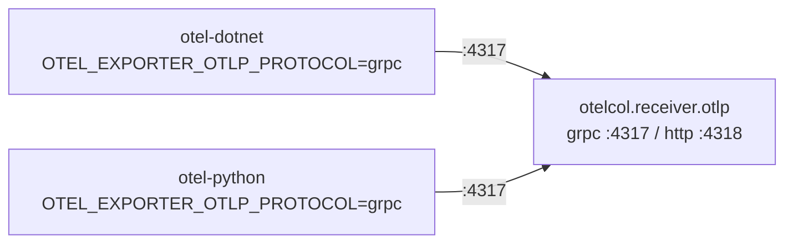

# ADR 002: OTLP contract between apps and Alloy

## Status
Accepted (inferred from current implementation).

## Context
Apps and the collector need to agree on a protocol, port, and transport for exporting telemetry. OTLP supports both gRPC and HTTP/protobuf transports, and Alloy can receive on either.

## Decision
Standardize on **OTLP over gRPC on port 4317** as the contract between every app (`otel-dotnet`, `otel-python`) and `otel-alloy`, even though Alloy's receiver ([config.alloy](../../otel-alloy/config.alloy)) also exposes an HTTP endpoint on port 4318.

## Rationale
- gRPC is the OpenTelemetry SDK default transport for both .NET and Python auto-instrumentation, requiring the least configuration deviation from out-of-the-box behavior.
- A single, consistent protocol across both language runtimes simplifies the deploy scripts (`OTEL_EXPORTER_OTLP_ENDPOINT` + `OTEL_EXPORTER_OTLP_PROTOCOL=grpc` are set identically in [infra/deploy-dotnet.sh](../../infra/deploy-dotnet.sh) and [infra/deploy-python.sh](../../infra/deploy-python.sh)).

## Consequences
- Port 4318 (HTTP) is defined on the Alloy receiver but currently **unused** by any component in this repo — it exists for future flexibility (e.g. a non-gRPC-capable client) but is dead configuration today.
- If you rename the Alloy Container App or change its listening port, you must update `OTEL_EXPORTER_OTLP_ENDPOINT` on **every** app consistently — there is no service discovery beyond ACA's internal DNS-by-name convention (see [networking.md](../networking.md#internal-dns-and-service-to-service-communication)).
- Because gRPC requires a persistent connection, transient network blips between an app and Alloy may cause export retries/backoff behavior governed entirely by the OpenTelemetry SDK defaults — no custom retry/backoff configuration exists in this repo.
