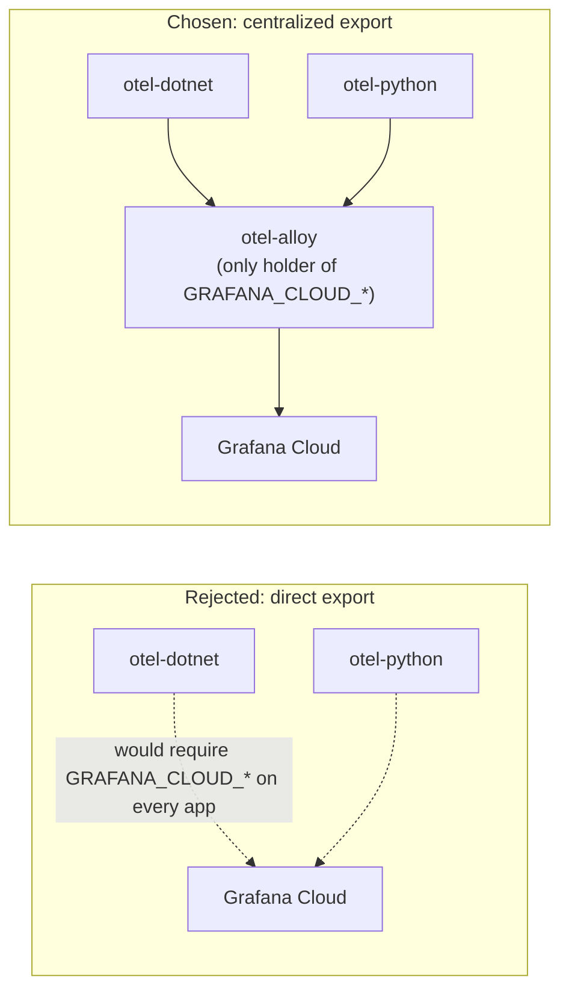

# ADR 004: Centralize telemetry export through a single collector

## Status
Accepted (inferred from current implementation).

## Context
Each app could export OTLP directly to Grafana Cloud itself (every OpenTelemetry SDK supports OTLP/HTTP with basic auth natively), removing the need for Alloy entirely. Alternatively, telemetry export can be centralized through one shared collector.

## Decision
Route **all** application telemetry through `otel-alloy` rather than having `otel-dotnet` and `otel-python` export directly to Grafana Cloud. This is the same underlying decision as [ADR 001](001-why-alloy.md), stated here specifically in terms of its **security and operational** consequences rather than the tool choice itself.

## Rationale
- **Credential blast radius** — if an app container is compromised, direct export would leak Grafana Cloud credentials from every app instance; centralized export confines that risk to a single component.
- **Single place to rotate credentials** — rotating `GRAFANA_CLOUD_API_KEY` means updating one Container App (`otel-alloy`), not every app independently.
- **Backend portability** — switching observability backends later touches only [otel-alloy/config.alloy](../../otel-alloy/config.alloy), not any application code or app-level deploy script (see [ADR 001](001-why-alloy.md)).

## Consequences
- Alloy is a **single point of failure for telemetry** (though not for application availability — see [ADR 001](001-why-alloy.md#consequences)).
- Deployment order is now a hard dependency: Alloy must exist before apps are deployed, and `infra/deploy-python.sh` explicitly enforces this by failing if the Alloy Container App isn't found (see [deployment.md](../deployment.md#deployment-flow)).
- All apps share Alloy's single `otelcol.processor.batch` buffering behavior, meaning a burst of traffic from any one app can momentarily delay the export of another's telemetry.
