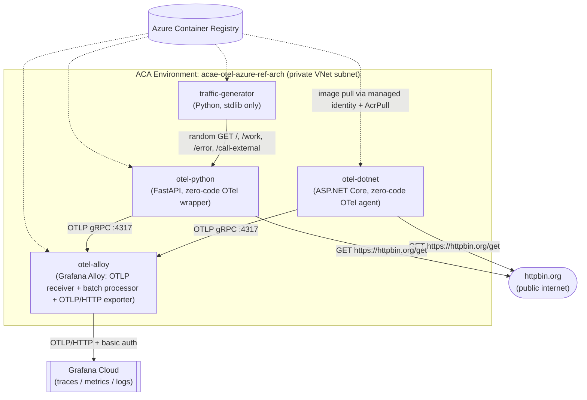
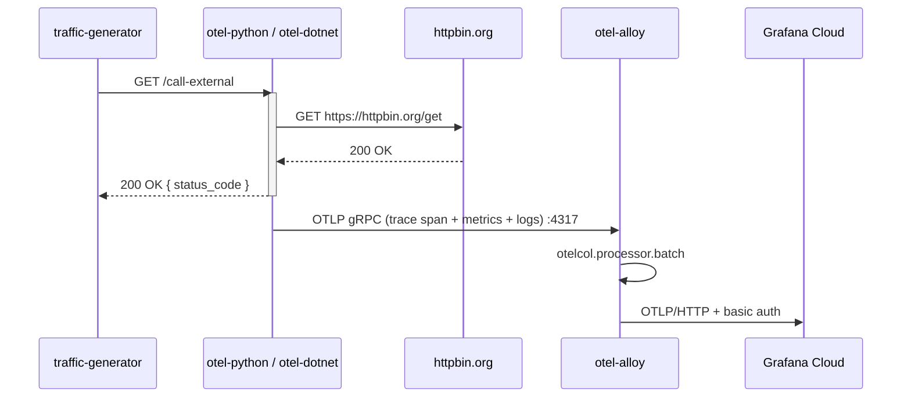

# Architecture

This page expands on the [root README's Architecture section](../README.md#architecture) with more detail on component boundaries and request/telemetry flow.

## Component diagram

## Why each component exists

| Component | Exists because... |
|---|---|
| `otel-dotnet` / `otel-python` | Two independent language implementations of the same demo API surface (`/`, `/work`, `/error`, `/call-external`), so zero-code instrumentation behavior can be compared side by side across .NET and Python. |
| `traffic-generator` | Demo/test environments are only useful if telemetry is actually flowing; a human clicking around is not a reliable source of continuous data for dashboards/alerts. |
| `otel-alloy` | Centralizes the only place that holds Grafana Cloud credentials, so individual app containers never need backend-specific configuration or secrets (see [ADR 004](adr/004-centralized-telemetry.md)). |
| Private VNet + internal ingress | A common enterprise constraint (no public ingress by default); demonstrates that zero-code instrumentation and OTLP export work fine entirely inside a private network (see [ADR 003](adr/003-private-aca.md)). |

## Request + telemetry flow (sequence)

Note that the OTLP export in the diagram above happens **asynchronously** relative to the HTTP response — the caller (`traffic-generator`) gets its response before telemetry is necessarily flushed to Alloy, because the export is buffered/batched by both the SDK and by Alloy's `otelcol.processor.batch`. This means there is an inherent, variable delay between "a request happened" and "you can see it in Grafana Cloud" — do not assume real-time visibility when debugging.

## Component responsibilities

See the [Major components and responsibilities table](../README.md#major-components-and-responsibilities) in the root README — it is the single source of truth for this and is not duplicated here to avoid drift.

## External dependencies

See the [External dependencies table](../README.md#external-dependencies) in the root README.

## Related ADRs

- [001 — Why Alloy](adr/001-why-alloy.md)
- [002 — OTLP contract](adr/002-otlp-contract.md)
- [003 — Private ACA](adr/003-private-aca.md)
- [004 — Centralized telemetry](adr/004-centralized-telemetry.md)
