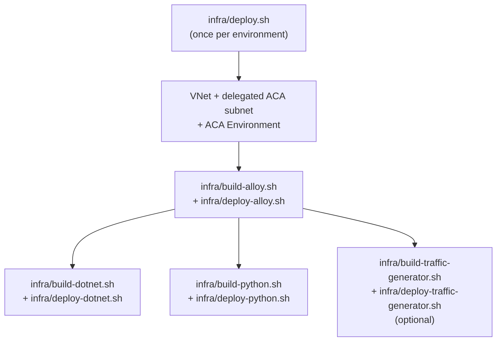
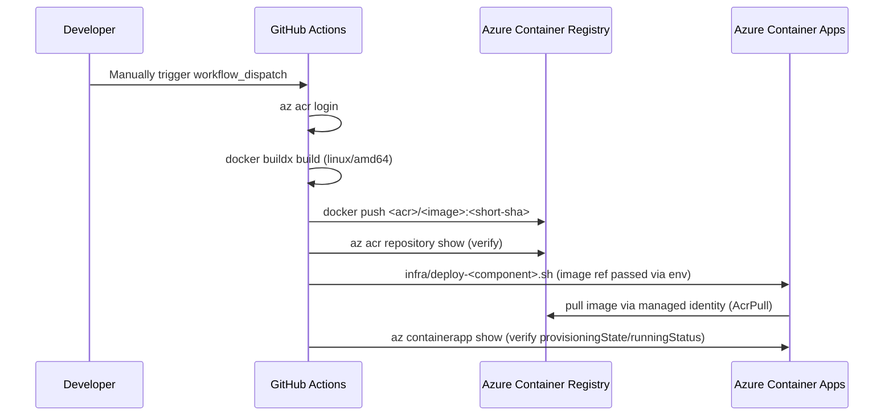

# Deployment

How images get built, pushed, and deployed to Azure Container Apps — covers both the manual/local path and the GitHub Actions path (they are functionally identical; CI just automates the same scripts).

## Deployment flow



**Order matters.** Alloy must be deployed before the apps, because `infra/deploy-python.sh` explicitly checks for the Alloy Container App and fails with "Alloy Container App ... was not found" if it's missing. The .NET deploy script does not perform this check, but the app will fail to export telemetry (not fail to start) if Alloy isn't reachable yet.

## CI/CD sequence



See [.github/workflows](../.github/workflows) for the four independent, `workflow_dispatch`-only pipelines — one per component. None of them trigger on `push` or `pull_request`.

## Environments

Only a single implicit environment is modeled: default resource group `rg-otel-azure-ref-arch`, default region `centralindia`. There are no dev/staging/prod parameter sets or GitHub Actions **environments** referenced in the workflows. To stand up a second environment, override `AZURE_RESOURCE_GROUP`, `AZURE_ACA_ENV_NAME`, `AZURE_ACR_NAME`, etc. per invocation — this is a manual process today (see [Information Required](../README.md#information-required)).

## Release process

There is no version tagging, changelog, or release automation. Every image is tagged with the **short git SHA** of the commit that triggered the build (except Alloy, whose build script defaults to the `latest` tag unless `AZURE_ALLOY_IMAGE_TAG` is overridden). Every manual `workflow_dispatch` run — or local `build+deploy` script pair — is effectively its own ad hoc release.

## Rollback

Azure Container Apps retains prior **revisions** automatically. To roll back:

```bash
# 1. Find the previous good revision
az containerapp revision list \
  --resource-group rg-otel-azure-ref-arch \
  --name otel-python \
  -o table

# 2. Shift 100% of traffic back to it
az containerapp ingress traffic set \
  --resource-group rg-otel-azure-ref-arch \
  --name otel-python \
  --revision-weight <previous-revision-name>=100
```

No script in this repo automates this — treat it as a manual, on-call operation. There is also no automated smoke test to confirm a rollback actually fixed the problem; verify manually via [telemetry.md](telemetry.md#verifying-telemetry-end-to-end) and/or `az containerapp logs show`.

## Teardown

`infra/destroy.sh` exists but is **currently empty** — there is no automated teardown. To remove everything created by this repo:

```bash
az group delete --name rg-otel-azure-ref-arch --yes
```

> Confirm the resource group contains **only** resources from this project before running this — it is irreversible.
