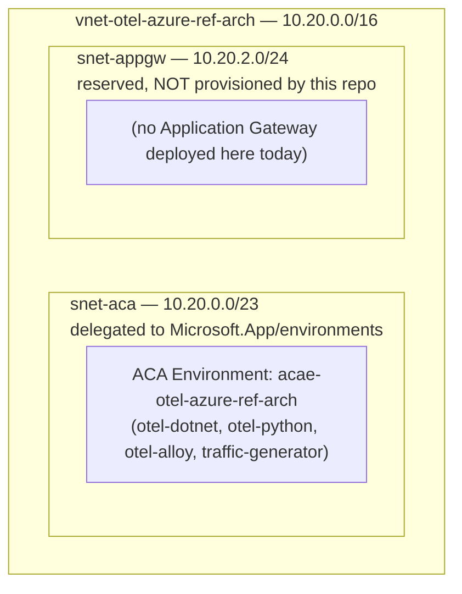
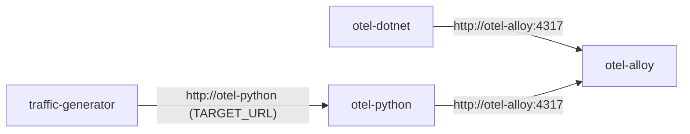

# Networking

Describes the VNet/subnet layout created by [infra/deploy.sh](../infra/deploy.sh) and how components reach each other.

## Subnet layout

| Subnet | Default CIDR | Purpose | Notes |
|---|---|---|---|
| `snet-aca` | `10.20.0.0/23` | Hosts the ACA Environment | Must stay delegated to `Microsoft.App/environments` — [infra/deploy.sh](../infra/deploy.sh) re-asserts this delegation on every run and fails if it's ever removed |
| `snet-appgw` | `10.20.2.0/24` | Reserved for a future Application Gateway / other public ingress point | **Nothing in this repo deploys anything into this subnet.** It exists purely as a reservation — see [Information Required](../README.md#information-required) |

All of the above is overridable via environment variables (`AZURE_VNET_NAME`, `VNET_CIDR`, `ACA_SUBNET_NAME`, `ACA_SUBNET_CIDR`, `APPGW_SUBNET_NAME`, `APPGW_SUBNET_CIDR`) — see [infra/deploy.sh](../infra/deploy.sh).

## Internal DNS and service-to-service communication

Container Apps inside the same ACA Environment can reach each other by **app name** over the environment's internal DNS — this is why apps are configured with `OTEL_EXPORTER_OTLP_ENDPOINT=http://otel-alloy:4317` rather than an IP address or FQDN. If you rename the Alloy Container App (`AZURE_ALLOY_APP_NAME`), you must update every app's OTLP endpoint to match, or telemetry export will silently fail (connection refused / DNS failure) with only container logs to reveal it.

## Ingress

Every Container App in this repo is created with `--ingress internal` (see every `infra/deploy-*.sh` script). Practical implications:

- **No public URL exists for any app by default.** There is no `*.azurecontainerapps.io` endpoint reachable from the internet.
- To reach a deployed app from your laptop, either:
  1. `az containerapp exec` into another Container App in the same environment and `curl` the internal name, or
  2. Temporarily flip ingress to external for debugging: `az containerapp ingress enable --type external --resource-group <rg> --name <app> --target-port <port> --transport http`, or
  3. Deploy an Application Gateway (or other ingress) into `snet-appgw` yourself — not automated here.
- Revert any temporary external ingress change back to `internal` when you're done, to avoid accidentally leaving a demo app publicly reachable.

## Outbound (egress) traffic

Both `otel-dotnet` and `otel-python` make an outbound call to the public internet (`https://httpbin.org/get`) from the `/call-external` endpoint. This traverses whatever default outbound path your ACA Environment/VNet provides (no NAT Gateway, firewall, or egress lockdown is configured by any script here). If your organization requires locked-down egress, either add a NAT Gateway/Azure Firewall to the VNet yourself, or point `/call-external`'s target at an internal service instead — see [Security considerations](security.md#security-considerations).
