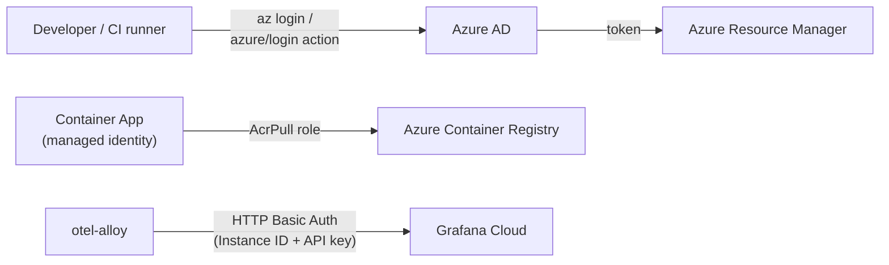

# Security

This page expands on the root README's [Security section](../README.md#security). It documents authentication, authorization, secrets handling, and known risk areas for this reference architecture.

## Authentication

| Path | Mechanism | Notes |
|---|---|---|
| Local developer → Azure | `az login` (interactive or device code) | No service principal needed for local script runs |
| GitHub Actions → Azure | `azure/login@v2` action, Service Principal (`client-id`/`client-secret`/`tenant-id`/`subscription-id`) | See the caution below — mixed with OIDC permissions in one workflow |
| Container App → ACR | User-assigned managed identity + `AcrPull` RBAC role, no stored credentials | Provisioned per-app by each `infra/deploy-*.sh` script |
| Alloy → Grafana Cloud | HTTP Basic Auth (`otelcol.auth.basic` in [config.alloy](../otel-alloy/config.alloy)) | Username = `GRAFANA_CLOUD_INSTANCE_ID`, password = `GRAFANA_CLOUD_API_KEY` |
| App → App (demo endpoints) | **None** | All demo endpoints are unauthenticated; acceptable only because ingress is internal-only |

> **Caution:** [buildAndDeployDotnet.yml](../.github/workflows/buildAndDeployDotnet.yml) declares `permissions: id-token: write` (an OIDC/federated-credential signal) but its `azure/login` step also supplies `client-secret`. Determine which model your Azure AD App Registration is actually configured for (OIDC federated credentials vs. classic client secret) and make the workflow consistent — as written, the `client-secret` input is either redundant or masking a misconfigured OIDC setup.

## Authorization

- Every managed identity created by the deploy scripts is granted **exactly one** RBAC role: `AcrPull` (role ID `7f951dda-4ed3-4680-a7ca-43fe172d538d`), scoped to **the ACR resource only** — not the resource group or subscription.
- No application-level authorization exists in `otel-dotnet` or `otel-python` — there is no auth middleware, API key check, or allow-list. **Do not reuse these apps as a template for anything internet-facing without adding authorization first.**

## Secrets management

| Secret | Where it lives (local) | Where it lives (CI) | Where it lives (deployed) |
|---|---|---|---|
| Azure Service Principal credentials | Not needed (uses `az login`) | GitHub Actions secrets (`AZURE_CLIENT_ID`, `AZURE_CLIENT_SECRET`, `AZURE_TENANT_ID`, `AZURE_SUBSCRIPTION_ID`) | N/A |
| Grafana Cloud credentials | Exported shell env vars (`GRAFANA_CLOUD_*`) before running `infra/deploy-alloy.sh` | GitHub Actions secrets | Container App environment variables on `otel-alloy` — visible via `az containerapp show` to anyone with read access |

There is **no secrets manager** (Azure Key Vault, etc.) integration anywhere in this repo. This is a known simplification appropriate for a disposable reference/demo environment, but should not be copied as-is into a production system — see [Limitations](../README.md#limitations).

`.gitignore` excludes `.env`, `.env.*` (except `.env.example`), `*.key`, and `*.pem` — there is no automated secret-scanning CI job enforcing this, so treat it as a convention, not a control.

## Security considerations for new maintainers

- **Private-by-default is intentional**, not an oversight — every Container App uses `--ingress internal`. This raises the bar for accidental public exposure but also means the "getting started" experience requires extra steps (see [networking.md](networking.md#ingress)).
- **The reserved Application Gateway subnet has nothing deployed in it.** Don't assume a WAF or any other protection exists in front of these apps just because the subnet is reserved.
- **No health probes** are configured on any Container App (no `--liveness-probe`/`--readiness-probe`), so Azure has no application-level signal to restart an unhealthy replica.
- **Outbound calls to `httpbin.org`** from `/call-external` leave your VNet to a public third-party domain — confirm this is acceptable for your environment's egress policy, or repoint it at an internal target.

## Dependencies and supply chain

| Dependency | Pinned? | Risk if not pinned |
|---|---|---|
| OpenTelemetry .NET Auto-Instrumentation installer (downloaded via `ADD` in [apps/otel-dotnet/Dockerfile](../apps/otel-dotnet/Dockerfile)) | Yes, `OTEL_VERSION=1.16.0` (build arg, overridable) | Pinned but **not checksum-verified** — a compromised release asset at that tag/version would go undetected |
| `uv` (downloaded via `COPY --from=ghcr.io/astral-sh/uv:latest` in [apps/otel-python/Dockerfile](../apps/otel-python/Dockerfile)) | **No** — uses the `latest` tag | Builds are not reproducible; a new `uv` release could silently change build behavior |
| Python/.NET package dependencies (`pyproject.toml`, `app.csproj`) | Version ranges (`>=`), not exact pins; no lockfile checked in for the .NET app | Standard supply-chain exposure common to most projects; no SBOM or dependency-scanning job exists in this repo today |

No Dependabot, Renovate, or SBOM-generation configuration was found in the repository.
