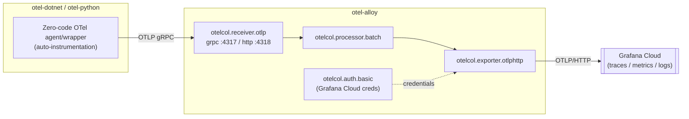

# Telemetry

How traces, metrics, and logs flow from the demo apps to Grafana Cloud, and what to check when they don't.

## Pipeline overview

Source of truth for the Alloy pipeline: [otel-alloy/config.alloy](../otel-alloy/config.alloy).

## Zero-code instrumentation, by language

| Language | Mechanism | Where it's wired in |
|---|---|---|
| .NET | [OpenTelemetry .NET Automatic Instrumentation](https://github.com/open-telemetry/opentelemetry-dotnet-instrumentation) agent, installed at Docker build time, app launched via its `instrument.sh` wrapper | [apps/otel-dotnet/Dockerfile](../apps/otel-dotnet/Dockerfile) `ENTRYPOINT` |
| Python | `opentelemetry-bootstrap` (installs instrumentation packages matching the app's actual dependencies) + `opentelemetry-instrument` launcher wrapping `uvicorn` | [apps/otel-python/Dockerfile](../apps/otel-python/Dockerfile) `CMD` |

**Important:** instrumentation is applied entirely inside the container image's startup command. If you run `dotnet run` or `uvicorn app.main:app` directly on your host, you get **no telemetry at all** — this is a common source of "it's not working" confusion for new contributors. Always run via the built Docker image to observe instrumentation behavior locally.

## Configuration

### Alloy (secrets — see [security.md](security.md#secrets-management))

| Variable | Required | Purpose |
|---|---|---|
| `GRAFANA_CLOUD_INSTANCE_ID` | Yes | Basic auth username for the Grafana Cloud OTLP endpoint |
| `GRAFANA_CLOUD_API_KEY` | Yes | Basic auth password |
| `GRAFANA_CLOUD_OTLP_ENDPOINT` | Yes | Grafana Cloud's OTLP/HTTP ingestion URL |

### Apps (set by `infra/deploy-dotnet.sh` / `infra/deploy-python.sh`)

| Variable | Default (Azure) | Purpose |
|---|---|---|
| `OTEL_SERVICE_NAME` | `zero-code-dotnet-demo` / `zero-code-python-demo` | Service name attached to all telemetry |
| `OTEL_TRACES_EXPORTER` / `OTEL_METRICS_EXPORTER` / `OTEL_LOGS_EXPORTER` | `otlp` | Overrides the Dockerfile's `console` default once deployed to Azure |
| `OTEL_EXPORTER_OTLP_ENDPOINT` | `http://otel-alloy:4317` | Internal DNS name of the Alloy Container App — **must match `AZURE_ALLOY_APP_NAME`** or export silently fails |
| `OTEL_EXPORTER_OTLP_PROTOCOL` | `grpc` | Must match Alloy's `otelcol.receiver.otlp` `grpc` block (port 4317) |
| `OTEL_METRIC_EXPORT_INTERVAL` | `5000` (ms) | How often metrics are flushed |
| `OTEL_RESOURCE_ATTRIBUTES` | `deployment.environment=azure` | Resource-level tagging visible in Grafana Cloud |

## Verifying telemetry end-to-end

There is no automated validation script today (`scripts/validate-telemetry.sh` exists but is empty — see [Limitations](../README.md#limitations)). Until that's implemented, verify manually:

1. Confirm Alloy is running: `az containerapp show --resource-group <rg> --name otel-alloy --query properties.runningStatus`.
2. Confirm Alloy's env vars are set: `az containerapp show --resource-group <rg> --name otel-alloy --query properties.template.containers[0].env`.
3. Generate traffic (deploy `traffic-generator`, or manually `curl` an app endpoint from inside the ACA environment).
4. Check Alloy's logs for export errors: `az containerapp logs show --resource-group <rg> --name otel-alloy --follow`.
5. Check Grafana Cloud's Explore view for the service name you expect (`zero-code-dotnet-demo` / `zero-code-python-demo`).

Remember there is an inherent buffering delay (SDK batch export + `otelcol.processor.batch`) — absence of data for the last few seconds is not necessarily a failure.

## Known gaps

- No dashboards or alert rules are checked into this repository — build them directly in Grafana Cloud.
- No health-check endpoints exist in either app, so "is the app itself healthy" cannot be inferred from telemetry alone.
- `traffic-generator` is not instrumented, so it does not appear as a traced caller — only the downstream apps' inbound spans are visible.
